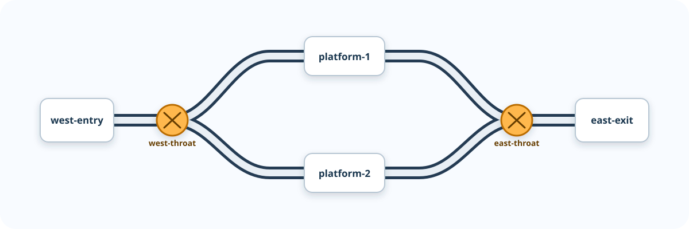

# Layout configuration

Gleiswerk v0.0.2 defines a small, versioned contract for describing a layout's
named blocks, turnouts, and routes. It describes configuration data only; it
does not define controller addresses, occupancy detection, movement, signals,
dispatching, simulator behavior, or hardware behavior.

Each layout is a UTF-8 TOML file with the `.toml` extension. The examples use
`layout.toml`.

## Reference layout

The compact [reference layout](https://github.com/micknudsen/gleiswerk/blob/master/examples/reference-layout.toml)
exercises every version-1 vocabulary element: blocks, turnouts, routes, and
turnout requirements. It is validated through the public command-line interface
in the automated test suite, so it is the canonical full-layout example for
this documentation. Like every version-1 layout, it is descriptive
configuration only and does not imply operating behavior.

The following conceptual track plan illustrates the names used by the reference
layout. Schema version 1 does not encode or validate topology, so the diagram
is explanatory only and does not authorize train movement.



`schema-version` is required and is currently `1`. A reader must reject an
unsupported version rather than guessing how to interpret it. An empty layout
is valid:

```toml
schema-version = 1
```

The only permitted top-level keys are `schema-version`, `blocks`, `turnouts`,
and `routes`. The three collection tables are optional and, when present, are
keyed by their IDs. A block contains only optional metadata. A turnout declares
its supported positions and may have optional metadata. A route has required
ordered `blocks` and optional `turnouts` requirements.

## Identifiers and names

An identifier is a non-empty lowercase kebab-case string:

```text
^[a-z][a-z0-9]*(?:-[a-z0-9]+)*$
```

IDs are stable machine references. They are unique within their own namespace:
a block, turnout, and route may technically have the same ID, although
configuration authors should prefer distinct, descriptive IDs.

`display-name` is an optional non-empty string on a block, turnout, or route.
It is operator-facing metadata only and is never used as a reference. If it is
absent, a consumer uses that object's ID as its effective display name.

## Objects

### Blocks

Each entry in `[blocks]` declares a block. Its only permitted field in schema
version 1 is optional `display-name`.

```toml
[blocks.platform-1]
display-name = "Platform 1"
```

### Turnouts

Each entry in `[turnouts]` declares a turnout. It permits these fields:

| Field | Required | Type | Meaning |
| --- | --- | --- | --- |
| `positions` | Yes | array of position IDs | Distinct selectable positions of the turnout. |
| `display-name` | No | string | Operator-facing turnout name. |

`positions` contains two or more distinct kebab-case IDs. Position IDs are
local to their turnout: different turnouts may use different vocabularies.
This describes selectable states only; it does not describe physical geometry,
handedness, topology, or controller commands. A two-way turnout can use
`normal` and `reverse`; a three-way turnout can use `left`, `center`, and
`right`.

```toml
[turnouts.west-entry]
display-name = "West entry turnout"
positions = ["normal", "reverse"]

[turnouts.station-throat]
positions = ["left", "center", "right"]
```

### Routes

Each entry in `[routes]` declares a directional route. It permits these fields:

| Field | Required | Type | Meaning |
| --- | --- | --- | --- |
| `blocks` | Yes | array of block IDs | Non-empty ordered traversal of declared blocks. |
| `turnouts` | No | table | Turnout-ID-to-position requirements. |
| `display-name` | No | string | Operator-facing route name. |

The `blocks` array must contain at least one item and must not repeat a block
ID. Each ID must reference a declared block. A repeated visit would imply a
loop or reversal whose topology and operational semantics are outside schema
version 1. Ordering is configuration data, not a command to move a train.

`turnouts` maps declared turnout IDs to one of that turnout's declared
positions. Each mapping states the position required for the route; it does not
command a turnout or determine whether the route is safe to set.

```toml
[routes.arrival-to-platform-1]
blocks = ["west-entry", "platform-1"]

[routes.arrival-to-platform-1.turnouts]
west-entry = "normal"
```

## Validation and diagnostics

Validation is deterministic: the same file produces the same diagnostics in
the same order. A TOML syntax error prevents structural validation and must be
reported with the parser's source location. For syntactically valid TOML, a
validator collects all contract violations before reporting them.

Diagnostics are ordered as follows: top-level and version errors; blocks by ID;
turnouts by ID; then routes by ID. Fields are checked in the order documented
above. Each diagnostic has a stable error code, a configuration path, and a
human-readable message. For example:

```text
ERROR E102 routes.arrival-to-platform-1.blocks[1]:
  references unknown block "platform-1"

ERROR E203 routes.arrival-to-platform-1.turnouts.west-entry:
  expected one of the declared positions "normal" or "reverse", got "straight"
```

The exact error-code registry will be introduced with the first validator, but
the path form and deterministic ordering are part of this contract.

## Command-line validation

Validate a layout file before using it with other Gleiswerk commands:

```console
gleiswerk layout validate layout.toml
```

For a valid file, the command prints the supplied path and exits with status
zero:

```text
Layout is valid: layout.toml
```

For an invalid file, it exits with status 1 and writes the ordered diagnostics
to standard error. Paths in both success messages and diagnostics are shown
exactly as supplied on the command line.

## Loading API and error codes

Python callers load a layout through the configuration boundary, not through a
CLI-specific function:

```python
from pathlib import Path

from gleiswerk.layout_config import LayoutConfigurationError, load_layout

try:
    layout = load_layout(Path("layout.toml"))
except LayoutConfigurationError as error:
    for diagnostic in error.diagnostics:
        print(diagnostic.format())
```

`load_layout` accepts only an existing, readable regular file whose suffix is
exactly lowercase `.toml`. It raises `LayoutConfigurationError` for file,
encoding, TOML syntax, and structural-validation failures. Each error contains
an ordered tuple of `Diagnostic` values. A diagnostic keeps the source filename
separate from its configuration path, allowing non-CLI consumers to identify a
field without parsing display text:

```text
diagnostic.source == Path("layout.toml")
diagnostic.path == "routes.arrival-to-platform-1.turnouts.west-entry"
```

Diagnostic codes are stable and grouped by concern:

| Range | Concern |
| --- | --- |
| `E0xx` | File suffix/access, UTF-8 decoding, and TOML syntax. |
| `E1xx` | Schema vocabulary, types, identifiers, and local object rules. |
| `E2xx` | Route references and turnout-position compatibility. |

The version-1 registry is:

| Code | Meaning |
| --- | --- |
| `E001` | File suffix is not exactly `.toml`. |
| `E002` | Path is not an existing regular file. |
| `E003` | File is not UTF-8 text. |
| `E004` | File cannot be read. |
| `E005` | TOML syntax is invalid. |
| `E100` | Parsed configuration is not a table. |
| `E101`–`E105` | Top-level required fields, version, vocabulary, or collection-table shape is invalid. |
| `E106`–`E107` | Object vocabulary or display name is invalid. |
| `E110`–`E111` | Block ID or block-table shape is invalid. |
| `E120`–`E126` | Turnout ID, table shape, or positions are invalid. |
| `E130`–`E139` | Route ID, table shape, blocks, or turnout requirements are invalid. |
| `E201` | A route references an unknown block. |
| `E202` | A route references an unknown turnout. |
| `E203` | A route requires a position unsupported by its turnout. |

Unknown fields are errors at every level, including the top level. This catches
misspellings and prevents a reader from silently ignoring configuration. A
field introduced in a later version requires that later `schema-version`.

Schema version 1 validates:

- the required `schema-version` and its supported value;
- top-level, object, and route-field vocabulary;
- identifier syntax and value types;
- non-empty `display-name` values where supplied;
- turnout position lists with two or more distinct position IDs;
- non-empty route block lists without duplicate IDs;
- route references to declared blocks and turnouts; and
- route turnout positions declared by their referenced turnout.

It intentionally does not validate physical connectivity, route conflicts,
turnout safety, or operational state. Those require a later topology and
safety model.
